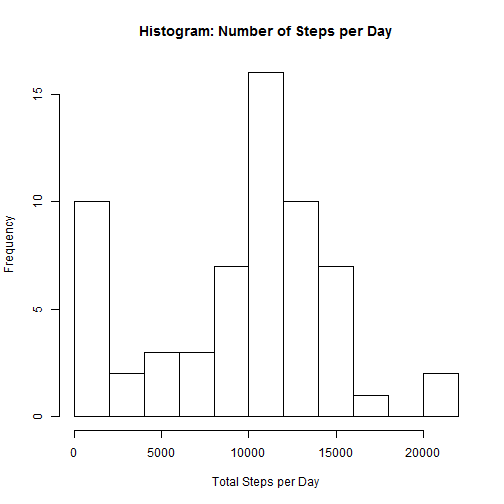
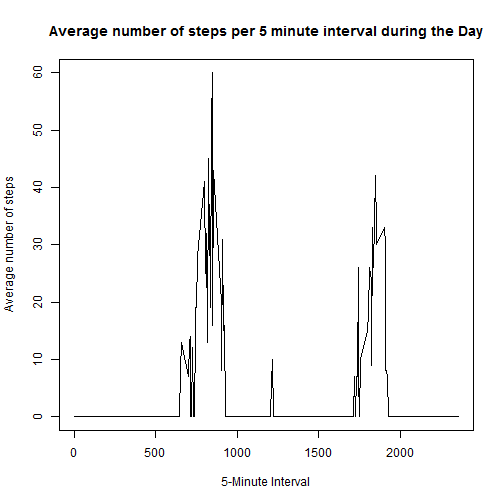
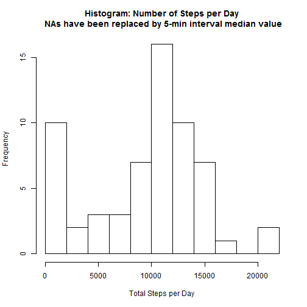
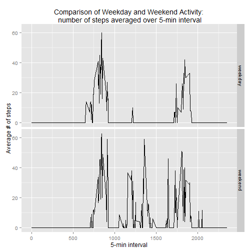

*This R Markdown document walks through the steps for Peer Assessment 1, part of 
the homework for Coursera's Reproducible Research class.*

## Loading and preprocessing the data
This document assumes that the raw data "activity.zip" has already been downloaded
into your R working directory. This will be the case if you have forked and 
cloned the [RepData_PeerAssessment1](http://github.com/rdpeng/RepData_PeerAssessment1) repository.

Unzip the data, read in the file, and look at a summary of the data.

```r
library(dplyr)
library(ggplot2)

unzip('activity.zip')
data <- read.csv("activity.csv", colClasses = c("numeric", "Date", "numeric"))
str(data)
```

```
## 'data.frame':	17568 obs. of  3 variables:
##  $ steps   : num  NA NA NA NA NA NA NA NA NA NA ...
##  $ date    : Date, format: "2012-10-01" "2012-10-01" ...
##  $ interval: num  0 5 10 15 20 25 30 35 40 45 ...
```

```r
summary(data)
```

```
##      steps             date               interval     
##  Min.   :  0.00   Min.   :2012-10-01   Min.   :   0.0  
##  1st Qu.:  0.00   1st Qu.:2012-10-16   1st Qu.: 588.8  
##  Median :  0.00   Median :2012-10-31   Median :1177.5  
##  Mean   : 37.38   Mean   :2012-10-31   Mean   :1177.5  
##  3rd Qu.: 12.00   3rd Qu.:2012-11-15   3rd Qu.:1766.2  
##  Max.   :806.00   Max.   :2012-11-30   Max.   :2355.0  
##  NA's   :2304
```
Note that there are over 2,000 NAs in the 17,568 row data set. This is around 11% of
the data.


## What is mean total number of steps taken per day?
1. First, calculate the total number of steps taken per day. You can use the dplyr
package to do this very quickly. The dataframe stepCount below contains a table
showing the total number of steps for each day in the data set.

```r
stepCount <- summarise(group_by(data, date), total = sum(steps, na.rm = TRUE))
head(stepCount)
```

```
## Source: local data frame [6 x 2]
## 
##         date total
## 1 2012-10-01     0
## 2 2012-10-02   126
## 3 2012-10-03 11352
## 4 2012-10-04 12116
## 5 2012-10-05 13294
## 6 2012-10-06 15420
```
2. Next, make a histogram of the total number of steps taken each day. You can see 
that on most days, the subject took between 10,000 and 12,000 steps. Surprisingly,
the number of days on which the subject took very few steps was fairly high; the lowest bucket of steps (0 - 2,000) had frequency of 10.


```r
hist(stepCount$total, breaks = 10, main = "Histogram: Number of Steps per Day", xlab = "Total Steps per Day", ylab = "Frequency")
```

 


3. Finally, calculate and report the mean and median of the total number of steps
take per day. 

These values end up being pretty close. Keep in mind that these calcs are done
on the data frame from which you already removed the NA values. 

```r
meanSteps <- mean(stepCount$total)
paste("The mean number of steps per day was", round(meanSteps, 0))
```

```
## [1] "The mean number of steps per day was 9354"
```

```r
medianSteps <- median(stepCount$total)
paste("The median number of steps per day was", medianSteps)
```

```
## [1] "The median number of steps per day was 10395"
```


## What is the average daily activity pattern?
1. Make a time series plot of the 5-minute interval and average number of steps
take, averaged across all days. 

When viewing the resulting graph, it appears as though the highest number of steps
occur when the subject is going to and from work or school. There is also a small
but clear step increase during the lunch hour. 

```r
intervals <- summarise(group_by(data, interval), average = median(steps, na.rm = TRUE))
plot(x = intervals$interval, y = intervals$average, type = "l", main = "Average number of steps per 5 minute interval during the Day", xlab = "5-Minute Interval", ylab = "Average number of steps")
```

 

2. Which 5-minute interval, on average across all the days in the dataset, contains
the maximum number of steps? 

The interval at 845 has the highest average number of steps, 60.
This could be interpreted as the subject starting their day and heading to work,
around 8:45 a.m. Note again, that this calculation is based on the median, and the 
formula omitted NAs. 


```r
maxInterval <- intervals[intervals$average == max(intervals$average),]
maxInterval
```

```
## Source: local data frame [1 x 2]
## 
##   interval average
## 1      845      60
```


## Imputing missing values
As we saw earlier, about 11% of the data is NA, or missing. 

1. Calculate and report the total number of missing values in the dataset. 

```r
sum(is.na(data))
```

```
## [1] 2304
```
2. Devise a strategy for filling in all of the missing values in the dataset.

In the case of NAs, we'll assume that the median value for a particular 5 minute interval can be a good proxy for what the value should be.

```r
imputed <- data
imputed$steps[is.na(imputed$steps)] <- intervals$average
```
3. Create a new data set that is equal to the original data set but with the missing
data filled in.

```r
str(imputed)
```

```
## 'data.frame':	17568 obs. of  3 variables:
##  $ steps   : num  0 0 0 0 0 0 0 0 0 0 ...
##  $ date    : Date, format: "2012-10-01" "2012-10-01" ...
##  $ interval: num  0 5 10 15 20 25 30 35 40 45 ...
```

```r
summary(imputed)
```

```
##      steps          date               interval     
##  Min.   :  0   Min.   :2012-10-01   Min.   :   0.0  
##  1st Qu.:  0   1st Qu.:2012-10-16   1st Qu.: 588.8  
##  Median :  0   Median :2012-10-31   Median :1177.5  
##  Mean   : 33   Mean   :2012-10-31   Mean   :1177.5  
##  3rd Qu.:  8   3rd Qu.:2012-11-15   3rd Qu.:1766.2  
##  Max.   :806   Max.   :2012-11-30   Max.   :2355.0
```
4. Make a histogram of the total number of steps taken each day and report 
the *mean* and *median* total number of steps take per day. 

The imputed mean ends up 
being slightly higher (150 steps) than the mean which included NAs. The imputed
median is exactly the same as the full median, since it is simply picking the middle 
value. 


```r
imputedstepCount <- summarise(group_by(imputed, date), total = sum(steps))
hist(imputedstepCount$total, breaks = 10, main = "Histogram: Number of Steps per Day\n NAs have been replaced by 5-min interval median value", xlab = "Total Steps per Day", ylab = "Frequency")
```

 

```r
imputedmeanSteps <- mean(imputedstepCount$total)
paste("With imputed NA data, the mean number of steps per day was", round(imputedmeanSteps, 0))
```

```
## [1] "With imputed NA data, the mean number of steps per day was 9504"
```

```r
imputedmedianSteps <- median(imputedstepCount$total)
paste("With imputed NA data, the median number of steps per day was", imputedmedianSteps)
```

```
## [1] "With imputed NA data, the median number of steps per day was 10395"
```


## Are there differences in activity patterns between weekdays and weekends?
1. Create a new factor variable with two levels - "weekday" and "weekend".

```r
days <- imputed
days$dayType <- c("weekday")
weekends <- weekdays(days$date) == "Saturday" | weekdays(days$date) == "Sunday"
days$dayType[weekends] <- c("weekend")
days$dayType <- factor(days$dayType)
```
2. Make a panel plot containing a time series plot of the 5-minute interval and
the average number of steps taken, averaged across all weekday days or weekend days.

You can see that on the weekend, activity is spread throughout the day and many
more steps are taken, as compared to weekday averages. Weekend step levels also begin
later in the morning and continue until later at night (past 2000 interval, or 
approximately 8 p.m.)

```r
daysAvg <- summarise(group_by(days, interval, dayType), average = median(steps))
p <- ggplot(daysAvg, aes(interval, average)) + geom_line()
p + facet_grid(dayType ~ .) + labs(title = "Comparison of Weekday and Weekend Activity:\n number of steps averaged over 5-min interval") + xlab("5-min interval") + ylab("Average # of steps")
```

 
